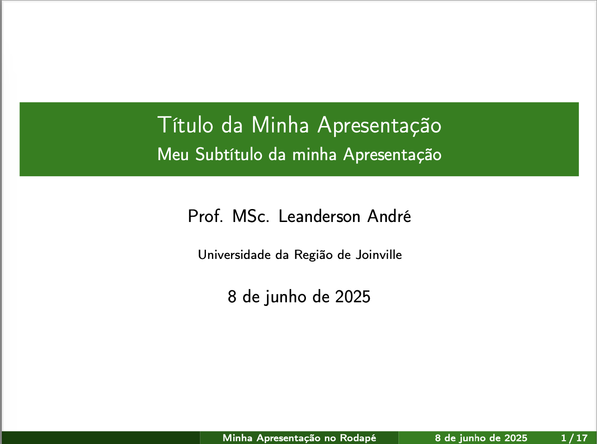
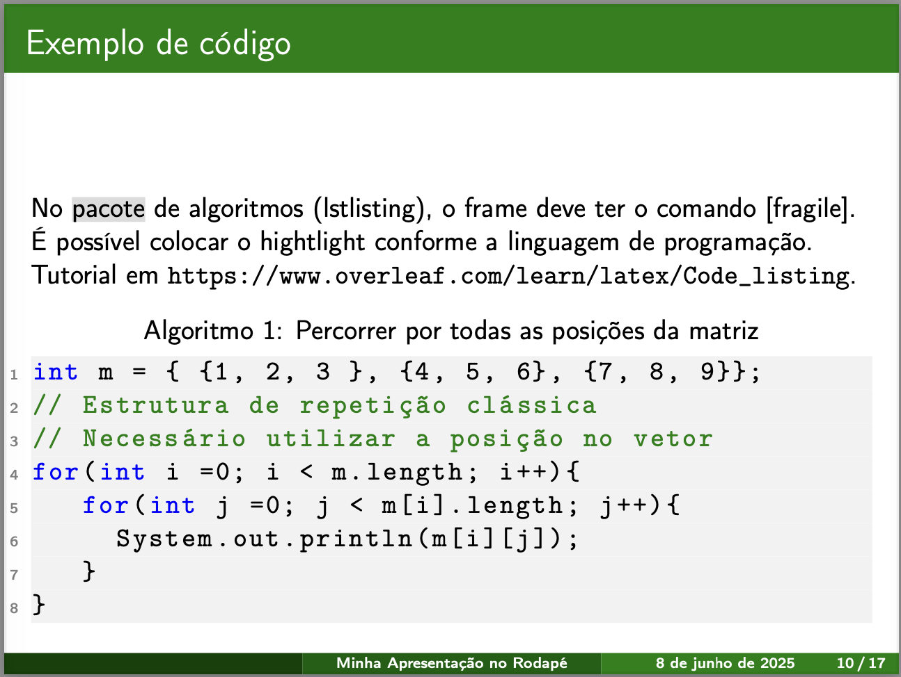
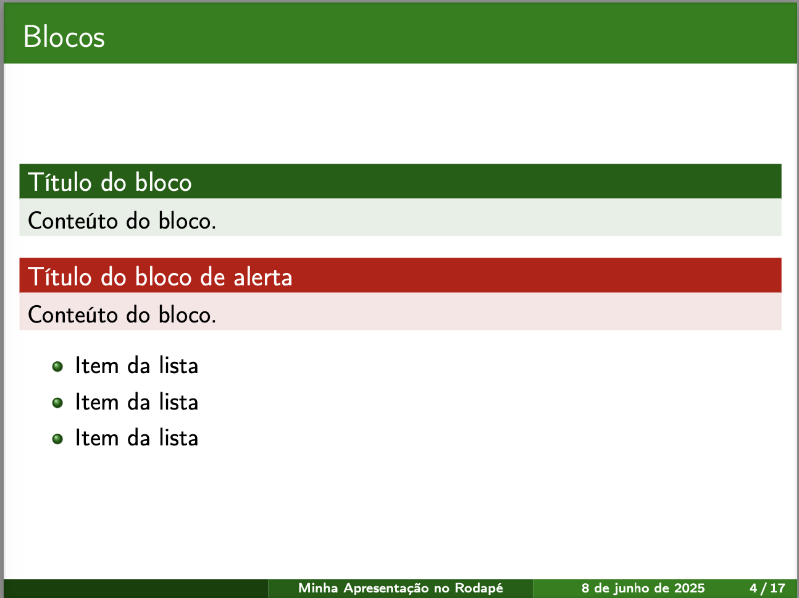
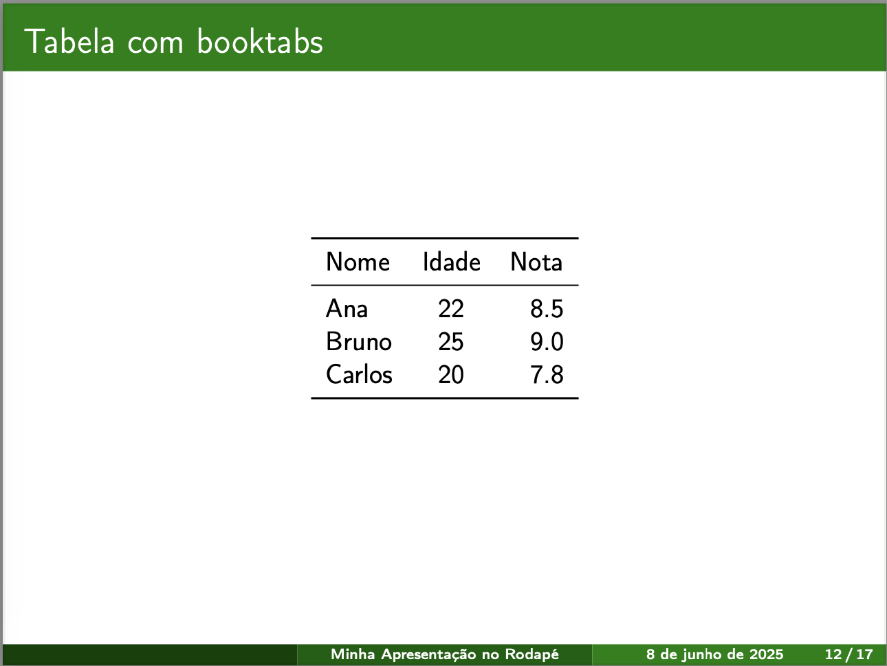
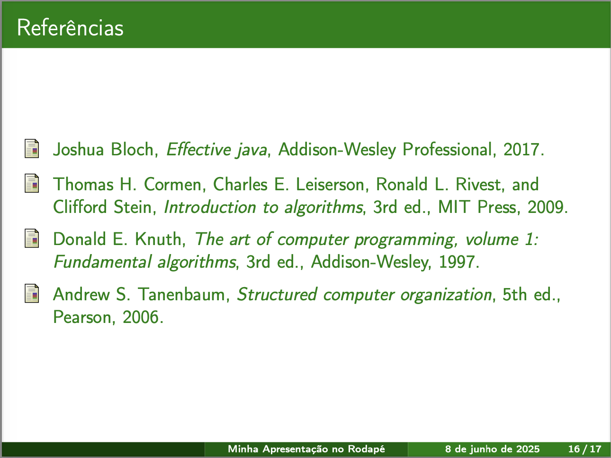
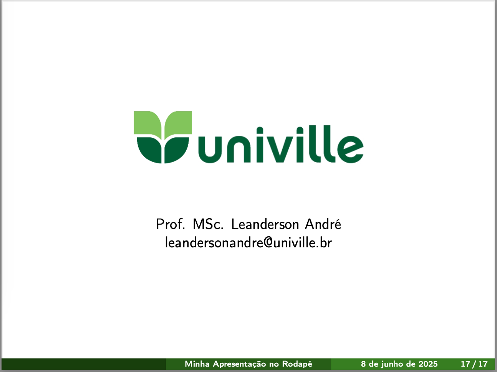

# univille-beamer-template

Template pessoal para apresentações em Beamer.

Este repositório contém meu template customizado para a classe Beamer do LaTeX, usado para criar apresentações com estilo próprio e formato adaptado às minhas necessidades acadêmicas e profissionais.

  
  
  
  
  
  

## Como usar

1. Clone ou faça download deste repositório.
2. Copie o arquivo do template para o seu projeto LaTeX.
3. Edite o arquivo `.tex` conforme suas necessidades, incluindo seus conteúdos e personalizações.
4. Compile o arquivo com `pdflatex`, `xelatex` ou `lualatex`, conforme sua preferência.

## Arquivo de Bibliografia

O arquivo `bibliografia.bib` contém as referências bibliográficas utilizadas no template. Ele está no formato BibTeX, que facilita a organização, a inclusão e a formatação automática das citações e referências na apresentação.

Para adicionar suas próprias referências:
- Edite o arquivo `bibliografia.bib` adicionando novas entradas seguindo o formato BibTeX.
- No arquivo `.tex` principal, use comandos como `\cite{chave}` para citar as referências.
- Compile o documento usando o BibTeX ou BibLaTeX, conforme configurado no template.

## Arquivo de exemplo: `apresentacao-template.pdf`

Este arquivo PDF é uma apresentação modelo gerada a partir do template. Ele demonstra a estrutura básica, o estilo visual e o uso dos recursos do template.

Criado por Leanderson André — Universidade da Região de Joinville (Univille).

